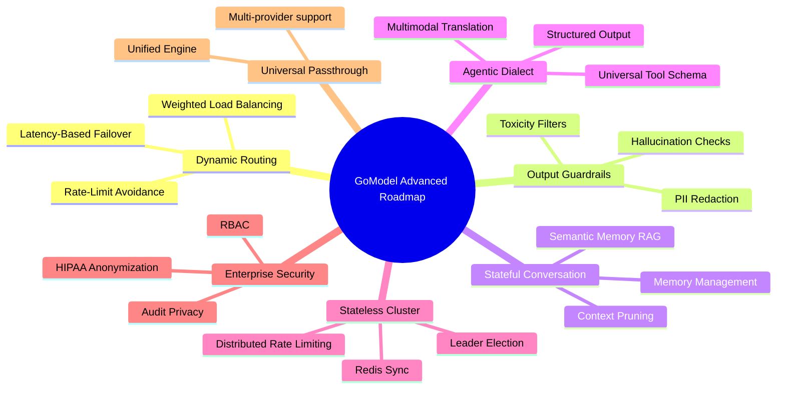

# GoModel - บทวิเคราะห์ช่องว่างทางสถาปัตยกรรมและฟีเจอร์ขั้นสูง (Architectural Gaps & Advanced Features Analysis)

เอกสารฉบับนี้จัดทำขึ้นเพื่อวิเคราะห์เจาะลึกระบบ **GoModel (AI Gateway)** โดยประเมินช่องว่างทางสถาปัตยกรรม (Architectural Gaps) และนำเสนอแนวทางการออกแบบฟีเจอร์ระดับสูงที่ยังขาดหายไป เพื่อยกระดับความสามารถสู่การใช้งานจริงในระดับอุตสาหกรรม (Enterprise Production-Ready) รวมถึงเป็นแนวทางพัฒนาโครงงานหรือการปรับปรุงสถาปัตยกรรมในอนาคต

---

## สรุปภาพรวมระดับสถาปัตยกรรม (Architecture Overview & Gaps)

GoModel เป็น AI Gateway ที่มีประสิทธิภาพสูง พัฒนาด้วยภาษา Go และยึดหลักสถาปัตยกรรมแบบบางเบา (Lightweight & High Performance) รองรับโปรโตคอลหลักเช่น OpenAI, Anthropic และระบบความปลอดภัยขั้นต้น แต่เพื่อให้สามารถแข่งขันกับคู่แข่งระดับสากล เช่น LiteLLM, Portkey หรือ Cloudflare AI Gateway ได้อย่างสมบูรณ์แบบ ระบบยังต้องการการปรับปรุงใน **7 แกนหลัก** ดังนี้:

---

## 1. ระบบจัดเส้นทางและสมดุลภาระงานแบบอัจฉริยะ (Intelligent & Dynamic Routing)

### 📌 รายละเอียดของฟีเจอร์
เพิ่มความสามารถในการกระจายคำขอ (Request) ไปยังผู้ให้บริการ (Providers) และบัญชี (API Keys/Endpoints) ที่แตกต่างกันอย่างยืดหยุ่น โดยอาศัยสถานะจริงของเครือข่าย ค่าใช้จ่าย และประวัติการทำงาน

### 🛠️ การออกแบบทางสถาปัตยกรรมและรายละเอียดเชิงลึก
* **Weighted Round Robin (WRR):** เพิ่มส่วนควบคุมการตั้งค่าน้ำหนักทราฟฟิก (Weight) ในกิ่ง `Workflow` ทำให้ระบบสามารถเลือกปลายทางได้ตามอัตราส่วน เช่น ส่งคำขอไป OpenAI (60%) และ Azure OpenAI (40%)
* **Latency-Based Routing:** ระบบทำการวัดและบันทึกความหน่วงเฉลี่ย (Exponential Moving Average Latency - EMA) ของแต่ละเครื่องมือปลายทางเป็นรายนาที และย้ายการจัดเส้นทางไปหา Instance ที่มีความหน่วงต่ำสุดโดยอัตโนมัติ
* **Adaptive Rate-Limit Avoidance:** หากเกิดความผิดพลาด `HTTP 429` (Rate Limit Exceeded) ตัวระบบ Gateway จะทำการทำสัญลักษณ์พักงาน (Circuit Breaker Cooldown) ของ API Key หรือ Endpoint ตัวนั้นเป็นเวลา 60 วินาที และสลับทราฟฟิกไปใช้คีย์สำรองทันที
* **ตำแหน่งโค้ดที่ควรพัฒนา:** สร้างโมดูลใหม่ชื่อ `internal/routing` เพื่อมาครอบและทำหน้าที่แทนการเลือก `RoutableProvider` ดั้งเดิมใน `internal/gateway`

---

## 2. ระบบคัดกรองเนื้อหาและความเป็นส่วนตัวขาออก (Output-Side Content & PII Guardrails)

### 📌 รายละเอียดของฟีเจอร์
ขยายขีดความสามารถของโครงข่ายระบบความปลอดภัย (Guardrails Pipeline) ให้ครอบคลุมถึงข้อมูลที่ได้ตอบกลับมาจากโมเดลภาษา (LLM Outputs) ก่อนที่ข้อมูลดังกล่าวจะถูกส่งกลับหรือทำสตรีมมิ่งไปยังฝั่งผู้ใช้

### 🛠️ การออกแบบทางสถาปัตยกรรมและรายละเอียดเชิงลึก
* **Streaming PII Redaction:** ปรับปรุง `NewObservedSSEStream` ให้ทำงานร่วมกับตัวกรองข้อมูลส่วนบุคคล (PII Filters) โดยระบบจะสแกนคำต่อคำ (Text Chunk Analysis) ผ่าน Regular Expressions หรือ Local NER (Named Entity Recognition) เพื่อเซ็นเซอร์ข้อมูลอ่อนไหว เช่น เลขบัตรเครดิต, ที่อยู่ หรือรหัสผ่าน ก่อนจะปล่อยข้อมูลหลุดออกไป
* **Output Toxicity & Safety Filters:** ตรวจหาเนื้อหาหยาบคาย รุนแรง หรือผิดนโยบายความมั่นคง ก่อนส่งกลับไคลเอนต์ หากตรวจเจอข้อความต้องห้าม ตัว Gateway จะตัดกระแสการสตรีมทันที และแจ้งข้อผิดพลาดที่เป็นระบบระเบียบไปยังไคลเอนต์แทน
* **ตำแหน่งโค้ดที่ควรพัฒนา:** บูรณาการเพิ่มเติมใน `internal/guardrails` และขยายตัวส่งผ่านสตรีมใน `internal/streaming` เพื่อทำหน้าที่กรองข้อมูลในลักษณะ On-the-fly

---

## 3. ระบบจัดการหน่วยความจำและรอบชีวิตของบทสนทนา (Conversational Memory & Stateful Thread Management)

### 📌 รายละเอียดของฟีเจอร์
การย้ายภาระในการจัดการและจดจำความทรงจำ (Stateful Chat Memory) จากแอปพลิเคชันฝั่งไคลเอนต์ มาฝากไว้ที่ระดับ Gateway เพื่อประหยัดทราฟฟิกและจัดการโค้ดไคลเอนต์ให้เป็นระเบียบขึ้น

### 🛠️ การออกแบบทางสถาปัตยกรรมและรายละเอียดเชิงลึก
* **Context Sliding Window & Token Pruning:** สร้างกลไกคุมความยาว Token โดยอัตโนมัติ เมื่อแชทยาวเกินไป ตัวระบบจะตัดส่วนของคำคุยที่เก่าที่สุดทิ้ง หรือย่อความ (Summarization) คำสนทนาก่อนหน้าเพื่อรักษาโควต้าค่าใช้จ่าย
* **Semantic History Retrieval (RAG memory):** เมื่อผู้ใช้สอบถามอ้างอิงเรื่องยาวในอดีต ระบบจะใช้วิธีค้นหาแบบ Semantic Search ดึงเฉพาะท่อนบทสนทนาในอดีตที่เกี่ยวข้องจาก `conversationstore` ขึ้นมาเป็น Context ให้โมเดลประเมิน แทนการส่งประวัติแชททั้งหมดไปทุกครั้ง
* **ตำแหน่งโค้ดที่ควรพัฒนา:** ขยายระบบ `internal/conversationstore` ให้สามารถเชื่อมโยงกับ Embedding Provider และ Vector database ในชั้น `internal/responsecache` ได้โดยตรง

---

## 4. ระบบแปลคำสั่งเครื่องมือและข้อมูลหลากหลายรูปแบบขั้นสูง (Advanced Tool & Multimodal Dialect Translator)

### 📌 รายละเอียดของฟีเจอร์
การแปลงข้อมูลขาเข้าและโครงสร้างซับซ้อน (Function/Tool Calling และข้อความที่มีภาพหรือไฟล์ - Multimodal) ให้มีรูปแบบเดียวกัน เพื่อให้นักพัฒนาสามารถสลับค่าย LLM ได้อย่างอิสระโดยไม่ต้องเขียนสกีมาควบคุมสลับไปมา

### 🛠️ การออกแบบทางสถาปัตยกรรมและรายละเอียดเชิงลึก
* **Universal Function Calling Engine:** ออกแบบตัวแปลคำสั่งกลาง (Unified Tool Schema) ที่สามารถแปลงสกีมาฟังก์ชันของฝั่ง OpenAI ไปหา Anthropic Tool format และ Google Gemini Function declaration ได้อย่างแม่นยำ 100% รวมทั้งแปลงผลลัพธ์กลับมาในฟอร์แมตกลาง
* **Multimodal Body Mapper:** ทำการแปลงโครงสร้างรูปภาพหรือสื่อผสม (เช่น Base64 Image, URL Image) จากรูปแบบของ OpenAI ไปเป็น `inline_data` สำหรับ Gemini และ `image` block สำหรับ Anthropic โดยอัตโนมัติ
* **ตำแหน่งโค้ดที่ควรพัฒนา:** พัฒนาเพิ่มในชุดไฟล์ `internal/providers` (เช่น `internal/providers/anthropic` และ `internal/providers/gemini`)

---

## 5. ระบบคลัสเตอร์ไร้สถานะสำหรับการควบคุมและโควต้าใช้งาน (Distributed Stateless Cluster Rate-Limiting)

### 📌 รายละเอียดของฟีเจอร์
ขยายความสามารถในการจำกัดอัตราการใช้งาน (Rate Limiting) และงบประมาณ (Budgets) ให้รองรับการนำ GoModel ไปเปิดใช้งานหลายเครื่องพร้อมกันเพื่อขยายระบบ (Stateless Scaling) โดยไม่ต้องพึ่งพาระดับ Local Memory อีกต่อไป

### 🛠️ การออกแบบทางสถาปัตยกรรมและรายละเอียดเชิงลึก
* **Distributed Token Bucket via Redis:** ปรับปรุงตัวจัดการงบประมาณและจำกัดอัตราการยิงใช้งาน (Rate limiter) ให้ใช้กลไก Redis Lua scripts ในการดึงและลบโทเค็นในอ่างรวม (Global Bucket) แบบอะตอมมิก ป้องกันความสับสนหรือค่าผิดพลาดเมื่อรันหลายเครื่อง
* **Cluster-wide Budget Lock:** เมื่อบัญชีหรือ `user_path` ใดใช้โควต้าเงินหรือโทเค็นเกินงบประมาณที่กำหนดไว้ ระบบต้องประกาศสถานะล้างการสิทธิ์ใช้งาน (Distributed Lock) ไปยังทุกๆ Node ในคลัสเตอร์ทันที
* **ตำแหน่งโค้ดที่ควรพัฒนา:** ปรับปรุงโมดูล `internal/budget` และเชื่อมประสานผ่าน `internal/cache` ที่รองรับ Redis

---

## 🔒 6. ระบบความปลอดภัยระดับองค์กรและการปกปิดข้อมูล (Enterprise Compliance, RBAC & HIPAA Anonymization)

### 📌 รายละเอียดของฟีเจอร์
ฟีเจอร์เพื่อความปลอดภัยและการตรวจสอบระบบที่สอดคล้องกับมาตรฐานอุตสาหกรรมขนาดใหญ่ เช่น การเงิน การธนาคาร การแพทย์ (HIPAA) และความมั่นคง

### 🛠️ การออกแบบทางสถาปัตยกรรมและรายละเอียดเชิงลึก
* **Role-Based Access Control (RBAC):** เพิ่มระบบสมาชิกและการแบ่งระดับสิทธิ์ควบคุมบนหน้าจอ Dashboard (เช่น Read-only Auditor, Billing Manager, Master Admin)
* **HIPAA Audit Compliance (Zero-Retention Mode):** เพิ่มออปชันใน config สั่งปิดการบันทึกข้อความแบบ Raw text (เช่น การสืบค้นเนื้อหา Prompt หรือ Response) ในฐานข้อมูล SQLite/PostgreSQL/MongoDB แต่ยังคงเก็บบันทึกสถิติจำนวนโทเค็นและค่าใช้จ่ายสำหรับรายงานการใช้เงินได้ (Metadata logs only)
* **ตำแหน่งโค้ดที่ควรพัฒนา:** พัฒนาเพิ่มระบบสิทธิ์ใน `internal/admin` และเพิ่มตัวกรองข้อมูลความลับใน `internal/auditlog`

---

## 🔌 7. ระบบส่งผ่านคำขอค่ายอื่นๆ แบบครอบจักรวาล (Universal Passthrough Engine)

### 📌 รายละเอียดของฟีเจอร์
การเปิดช่องทางระบบ Passthrough (การส่งข้าม API แบบดั้งเดิมผ่าน Endpoint `/p/{provider}/...`) ให้เสถียรและสามารถตรวจสอบ (Audit Log/Cost tracking) ได้ครบครันครอบคลุมทุกค่าย

### 🛠️ การออกแบบทางสถาปัตยกรรมและรายละเอียดเชิงลึก
* **Unified Passthrough Auditing:** ขยายขีดความสามารถให้สามารถดึงข้อมูล HTTP Headers และ API response payload จากระบบ Passthrough ของ Gemini Studio, Azure, Ollama และ Oracle มาใช้วัดคำนวณการใช้โทเค็นและประเมินราคาทุกครั้งเหมือนกับการใช้ API มาตรฐาน
* **Auto-discovery Passthrough:** เพิ่มฟังก์ชันในการจับคู่ Endpoint ดิบจากค่ายอื่นโดยอัตโนมัติ เพื่อนำมาวิเคราะห์บันทึกในหน้า Usage panel ได้ทันที
* **ตำแหน่งโค้ดที่ควรพัฒนา:** พัฒนาตัวควบคุมใน `internal/server/passthrough_support.go` และปรับสถาปัตยกรรมกลางของ `internal/providers`

---

## แผนงานการดำเนินการพัฒนา (Implementation Roadmap)

เพื่อให้การพัฒนาดำเนินการได้อย่างมีระเบียบและสร้างความคุ้มค่าสูงสุด แนะนำให้แบ่งการแก้ไขตามลำดับความสำคัญ (Priority) ดังตารางด้านล่างนี้ครับ:

| ลำดับความสำคัญ | เฟสการพัฒนา | หัวข้อฟีเจอร์ | ผลลัพธ์ทางธุรกิจ/วิชาการ |
| :---: | :--- | :--- | :--- |
| **1** | **Phase 1: Quick Wins** *(ทำง่าย มีผลงานชัดเจน)* | **1. Intelligent Dynamic Routing** **4. Advanced Tool Schema Translator** | จัดการปัญหาระบบล่มหรือ Rate limit ได้ทันที และนักพัฒนาสลับใช้โมเดลค่ายต่างกันได้อิสระ |
| **2** | **Phase 2: Core Platform** *(เพิ่มระบบความเสถียร)* | **5. Distributed Rate-limiting** **2. Output-Side Guardrails** | สามารถขยายการทำงานแบบหลาย Instance ได้อย่างเสถียร และมีมาตรฐานความปลอดภัยข้อมูลสูง |
| **3** | **Phase 3: Advanced UX & Stateful** | **3. Stateful Conversation Memory** **7. Universal Passthrough Engine** | ประหยัดแบนด์วิธของแอปพลิเคชัน และนำไปต่อยอดใช้ในงานประเภทระบบเอเจนต์ (Agentic) ได้อย่างล้ำหน้า |
| **4** | **Phase 4: Enterprise Ready** *(เสร็จสมบูรณ์)* | **6. Enterprise Security & HIPAA Compliance** | พร้อมสำหรับการนำโปรเจกต์นี้ไปขยายต่อยอดจำหน่ายให้องค์กรการเงินและการธนาคารขนาดใหญ่ |
