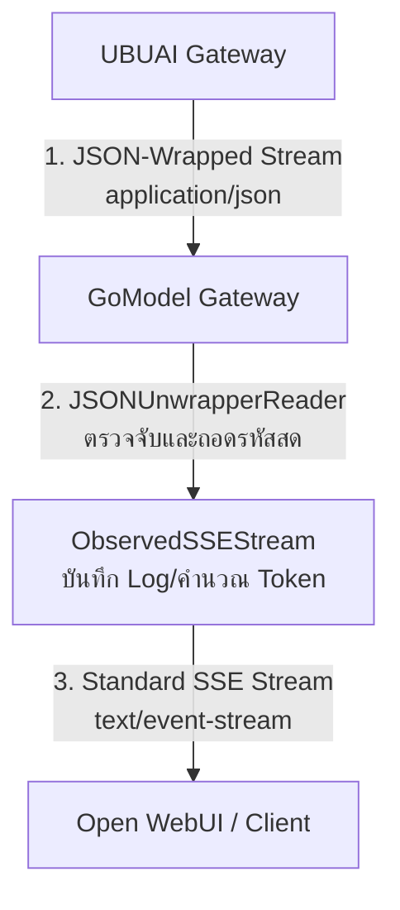

# รายงานวิเคราะห์ความผิดปกติและการทดสอบระบบ Streaming: UBUAI Gateway

รายงานฉบับนี้จัดทำขึ้นเพื่อวิเคราะห์ **ความผิดปกติเชิงเทคนิค (Abnormalities)** ของระบบ Streaming บน **UBUAI Gateway (https://aigateway.ubu.ac.th)** เปรียบเทียบกับมาตรฐานสากล (Standard Server-Sent Events) พร้อมระบุข้อดี ข้อเสีย และแนวทางการแก้ไขระบบให้ทำงานร่วมกับซอฟต์แวร์มาตรฐานระดับสากลได้อย่างสมบูรณ์แบบ

---

## 1. เปรียบเทียบความแตกต่าง: มาตรฐานสากล vs UBUAI Gateway

เพื่อให้เห็นภาพการทำงานเชิงลึกของข้อมูลดิบ (Raw HTTP Payload) ในโหมด **Streaming (`stream: true`)** ของระบบทั้งสองประเภท:

### 1.1 มาตรฐานสากล (Standard Server-Sent Events - SSE)
ระบบผู้ให้บริการชั้นนำระดับสากล เช่น OpenAI, Anthropic, Gemini, Ollama หรือ Groq จะส่งข้อมูลแบบ **Line-by-Line Chunking** ผ่านสาย HTTP Stream จริง ๆ 

* **Content-Type ใน Header:** `text/event-stream`
* **ข้อมูลดิบที่วิ่งบนสาย TCP/HTTP:**
  ```text
  data: {"choices": [{"delta": {"content": "สวัสดี"}}]}
  
  data: {"choices": [{"delta": {"content": "ครับ"}}]}
  
  data: [DONE]
  ```
  *(หมายเหตุ: แต่ละก้อนข้อมูลจะมี newline byte `0x0A` หรือ `\n\n` กั้นกลางจริง ๆ ทำให้ Client สามารถระบุบรรทัดเพื่อนำไปประมวลผลทีละคำได้อย่างลื่นไหลทันที)*

### 1.2 ความผิดปกติของ UBUAI Gateway (JSON-Wrapped Stream)
UBUAI Gateway นำผลลัพธ์การ Streaming ทั้งหมดที่ได้จากโมเดลของ OpenRouter มาทำการ **Double-Serialize (ห่อหุ้มซ้อนตัวแปร)** ให้กลายเป็น **JSON String ขนาดใหญ่เพียงก้อนเดียว** ส่งออกมาทีเดียว

* **Content-Type ใน Header:** `application/json; charset=utf-8` (แทนที่จะเป็น `text/event-stream`)
* **ข้อมูลดิบที่วิ่งบนสาย TCP/HTTP:**
  ```text
  ": OPENROUTER PROCESSING\n\n: OPENROUTER PROCESSING\n\ndata: {\"choices\": [{\"delta\": {\"content\": \"สวัสดี\"}}]}\n\ndata: {\"choices\": [{\"delta\": {\"content\": \"ครับ\"}}]}\n\ndata: [DONE]"
  ```
  * **จุดสังเกตความผิดปกติ:**
    1. **มีเครื่องหมายคำพูดคู่ `"` ครอบหัวท้ายสุด** ของ response stream ทั้งก้อน
    2. **เครื่องหมายขึ้นบรรทัดใหม่ถูกเข้ารหัส (Escaped)** ให้กลายเป็นอักษรพิมพ์ธรรมดาคือ `\n` และเครื่องหมายคำพูดถูกเข้ารหัสเป็น `\"`
    3. **ไม่มี newline byte (`0x0A`) ของจริงเลย** ข้อมูลทั้งหมดจึงถูกมองว่าเป็นตัวหนังสือ **"บรรทัดเดียวยาวเหยียด"**

---

## 2. ปัญหาเชิงเทคนิคเมื่อใช้งานร่วมกับโปรแกรมมาตรฐาน (เช่น Open WebUI)

โปรแกรมส่วนใหญ่ในโลก (เช่น Open WebUI, LibreChat, หรือ SDK ของ OpenAI) ใช้ไลบรารีในภาษา Python หรือ JavaScript (เช่น `aiohttp`, `requests`, `axios`) ในการประมวลผล Streaming:
1. ไลบรารีเหล่านี้จะเรียกฟังก์ชันอ่านทีละบรรทัด (`readline()`) เพื่อแกะข้อมูล `data:` ทีละชิ้น
2. เมื่อเจอบรรทัดยักษ์ของ UBUAI Gateway ที่ยาวเกิน **128KB (131,072 bytes)** เนื่องจากไม่มีตัวขึ้นบรรทัดใหม่จริง ๆ ไลบรารีความปลอดภัยระดับ HTTP Client ของ Python จะตัดกระบวนการทำงานทันทีเนื่องจาก **"บรรทัดยาวเกินความปลอดภัยเพื่อป้องกัน DoS (LineTooLong Error)"**
3. ผลลัพธ์คือการเชื่อมต่อถูกตัดกลางคัน แชทบอทตอบคำถามว่างเปล่า (Empty Response) และเกิด error `400 Bad Request` เสมอ

---

## 3. วิเคราะห์ ข้อดี - ข้อเสีย ของ UBUAI Gateway

หากวิเคราะห์ในเชิงวิชาการเพื่อทำความเข้าใจเหตุผลในการออกแบบระบบของทีมพัฒนา UBUAI Gateway:

### ข้อดี (Pros)
* **ป้องกัน Network Timeout ในระบบ Proxy:** การที่ทีมงานส่ง `: OPENROUTER PROCESSING` นำหน้ามาจำนวนมาก ช่วยรักษาท่อเชื่อมต่อ (Keep-Alive) ระหว่าง Gateway กับโมเดลฟรีที่มักมีคิวยาว เพื่อไม่ให้ reverse proxy (เช่น NGINX หรือ Cloudflare) ตัดการทำงานไปก่อน
* **ตรวจสอบและจัดเก็บ Log ได้ง่ายขึ้น:** การห่อข้อมูลทั้งหมดเป็นก้อนเดียวในรูปแบบ JSON ช่วยให้ระบบ Gateway สามารถดักจับโครงสร้าง JSON ทั้งหมดเพื่อทำ Audit logging หรือคำนวณ Token ในฐานข้อมูลของระบบได้ง่ายขึ้นในขั้นตอนเดียว (ไม่ต้องคอยต่อยอด Stream ที่ขาด)

### ข้อเสีย (Cons)
* **ขัดต่อมาตรฐานโลก (Breaking Standards):** การเปลี่ยน Content-Type เป็น `application/json` และหุ้ม SSE ด้วย string ขัดต่อข้อกำหนด W3C SSE Standard ทำให้ **ไม่สามารถเชื่อมต่อโดยตรงกับ Web UI หรือ SDK มาตรฐานสากลได้เลย** (ผู้ใช้ทั่วไปนำไปใช้ตรงๆ จะบั๊กทันที)
* **เกิด Overhead สูง:** ตัว Client ต้องแบกรับภาระในการดึงข้อมูลทั้งหมดไปถอดรหัส JSON Unescaping อีกรอบ
* **ทำให้ระบบเสี่ยงต่อ DoS Error ในฝั่ง Client:** ดั่งเช่นปัญหา `131072 bytes limit` ที่เราเผชิญบน Open WebUI

---

## 4. แนวทางการแก้ไขอันชาญฉลาดใน GoModel (Our Elegant Solution)

เราใช้ **Postel's Law (Robustness Principle)** ในการแก้ไขปัญหาที่ระบบ GoModel Gateway ของเรา โดยการเพิ่ม **`JSONUnwrapperReader`** เข้าไปแบบ Real-time:



### ข้อดีของโซลูชันที่เราทำ:
1. **แก้ปัญหาได้ 100%:** Open WebUI สามารถแชทกับโมเดลฟรีทุกตัวของ UBUAI ได้ลื่นไหล พิมพ์ตอบสด ๆ สวยงาม
2. **ปลอดภัยและเป็นมิตรกับโมเดลอื่น (No Side Effects):** หากข้อมูลที่เข้ามาไม่มีเครื่องหมาย `"` ครอบหัวท้าย (เป็นโมเดลปกติจาก Groq, Ollama) ตัวแปลงจะหลีกทางให้ทันทีโดยไม่มีการไปแก้ไขใด ๆ
3. **ประสิทธิภาพสูง (High Performance):** ไม่มีการโหลดเนื้อหาทั้งหมดมาเก็บไว้ในแรม แต่จะทำการถอดรหัสทีละ Byte ที่วิ่งผ่านสาย ช่วยประหยัดทรัพยากรเซิร์ฟเวอร์
